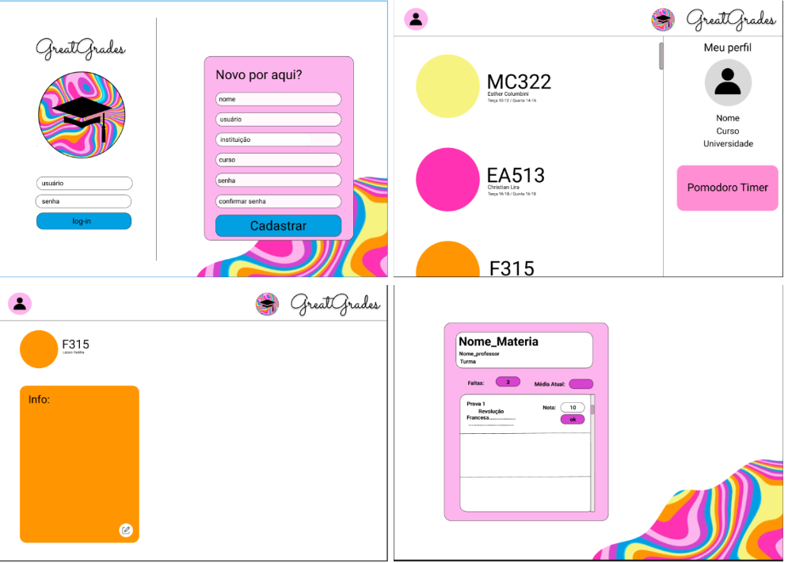
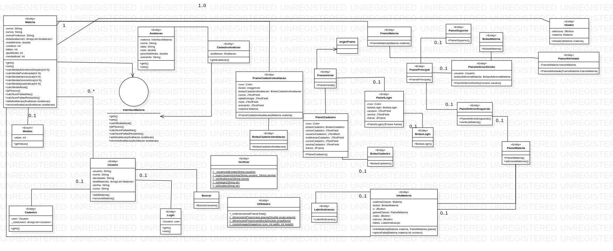

# GreatGrades - University Life Organizer 🎓

`GreatGrades` is a study app for university students. The app has a user-friendly interface and helps students organize their study routine by enabling the easy control of useful information, such as enrolled courses, activities, deadlines, absences, and their average grade. The application was fully developed in PT-BR to well-fit on the university subject.

## Development Process

### Initial Draft

With our objective defined, we used Figma to began to sketch the face application front-end. The result is presented in the image below.

There are four main screens:
 - a login and registration menu,
 - the main menu which provides an overview of each of the student's subjects,
 - a subject view screen that contains assessments, deadlines, and grades, and
 - a screen to view and add new exams.




### Defining Classes and program structure

Based on the initial sketch, we created the Product Backlog using User Stories. As a result, we obtained the UML diagram shown below.



---

## Project Specifications

### Tools Used

The project was developed entirely in **Java**, and the **Swing** library was used for the graphical interface. The chosen project model was **MVC (Model, View, Controller)**:

- **Model**: Describes the classes, their attributes, getters, and setters.
- **View**: Focuses on the implementation of the graphical interface.
- **Controller**: Contains methods that handle data, instantiate objects, and validate inputs.

### Main Classes and Methods

The main classes created were:

**Model**
- **User**: Refers to the person using the program. It holds data such as a username, name, institution, course, password, and a list of subjects registered by the user.
- **Subject**: Represents a course subject. It has attributes like name, professor's name, minimum grade for approval, workload, and the type of grade calculation. It also holds the user that registered the subject, and its respective grade based on the already registered exams.
- **Exam**: Belongs to a subject and has attributes: name, date, grade, weight in the average, and extra information.
- **Grade calculation**: Describes the way a subject is graded. All types inherit from the abstract class `OriginMedia`. The grade is recalculated each time a new assessment is added. Types include:
    * **Arithmetic Mean**: $\frac{1}{N}\sum_{i=0}^{N}(A_{i})$,
    * **Weighted Mean**: $\sum_{i=0}^{N}(P_{i}A_{i})$,
    * **Geometric Mean**: $\sqrt[N]{A_{1}\times A_{2}\times...\times A_{N}}$,
    * **Harmonic Mean**: $N/(\sum_{i=1}^{N}\frac{1}{A_{i}})$,
    * **Quadratic Mean**: $\sqrt{(\sum_{i=1}^{N}A_{i}^{2})/N}$,

    where $A_i$ is the grade of the $i_{th}$ exam, $N$ is the total number of registered exams and $P_i$ is the weight is each test in case of weighted mean.

**View**
* **Utilities**: A static class with helper functions for front-end implementation.
* **OriginFrame**: A class that holds a basic app window information (such as icon, title and size) and inherits from `JFrame`.
* **Other classes**: Correspond to the other front-end screens, such as login, main menu, and registration screens.

**Controller**
* **App**: The starting point for the program's execution.
* **AddSubject**: Class for creating a new subject and adding it to the user's list.
* **Search**: Performs searches for users, subjects, and exams.
* **Register**: Contains methods for registering a new user.
* **RegisterAssessment**: Instantiates a new assessment and adds it to a subject's list.
* **Delete**: Removes subjects or exams based on user commands.
* **Initialize**: Reads the CSV files at startup to load user data.
* **Login**: Verifies user credentials against registered information.
* **OriginFile**: Adds new rows to the CSV files for new users, subjects, or exams.
* **Verify**: Performs various checks, such as if a user already exists or if a string can be converted to a number.

### Saving to Files

We chose to save user data in CSV files to ensure information isn't lost when the application is closed. When a user, subject, or assessment is registered, it's saved to a corresponding CSV. This allows all data to be reloaded correctly when the user logs in again. `Users.csv` is crucial for verifying existing users and preventing duplicate usernames, while `Materias.csv` (Subjects.csv) and `Avaliacoes.csv` (Exams.csv) are necessary to link subjects and exams to each user.


---

## Version Control

To facilitate cooperation, we used **GitHub** for code sharing and version control, following the master and feature branches workflow.


---

## Final Thoughts

In conclusion, considering the ~3 week development timeframe, we developed the `GreatGrades` functions satisfactorily. To show the application use, we made a video, which you can access [here](https://www.youtube.com/watch?v=jm5M1_n8ygs).

---

## How to Run 🚀

To run this project, you will need to have the Java Development Kit (JDK) installed on your machine.

1.  **Clone the repository:**
    ```bash
    git clone [https://github.com/lcardosott/greatGrades.git](https://github.com/lcardosott/greatGrades.git)
    ```

2.  **Navigate to the project directory:**
    ```bash
    cd greatGrades
    ```

3.  **Ensure CSV files exist:** The application uses three CSV files to store data (`Users.csv`, `Materias.csv`, `Avaliacoes.csv`). Make sure these files exist in the root directory before the first run. You can create them with the following headers:
    * **Users.csv**: `USER`,`NOME`,`INSTITUICAO`,`CURSO`,`SENHA`
    * **Materias.csv**: `USER`,`NOME_MATERIA`,`TURMA`,`NOME_PROFESSOR`,`NOTA_MINIMA`,`NUMERO_CREDITO`,`NUMERO_FALTAS`,`TIPO_MEDIA` 
    * **Avaliacoes.csv**: `USER`,`NOME_MATERIA`,`NOME_AVALIACAO`,`DATA_AVALIACAO`,`NOTA`,`PESO_NA_MEDIA`,`EXTRA_INFO`

4.  **Compile the Java code:** The project follows an MVC structure. Compile all source files from the root directory.
    ```bash
    javac -d bin Projeto/src/controller/*.java Projeto/src/model/*.java Projeto/src/model/CalcMedias/*.java Projeto/src/view/addMateria/*.java Projeto/src/view/baseClasses/*.java Projeto/src/view/cadastroAvaliacao/*.java Projeto/src/view/firstPage/*.java Projeto/src/view/menuprincipal/*.java Projeto/src/view/verMateria/*.java
    ```

5.  **Run the application:** The main entry point for the program is the `App` class.
    ```bash
    java -cp bin controller.App
    ```

---
